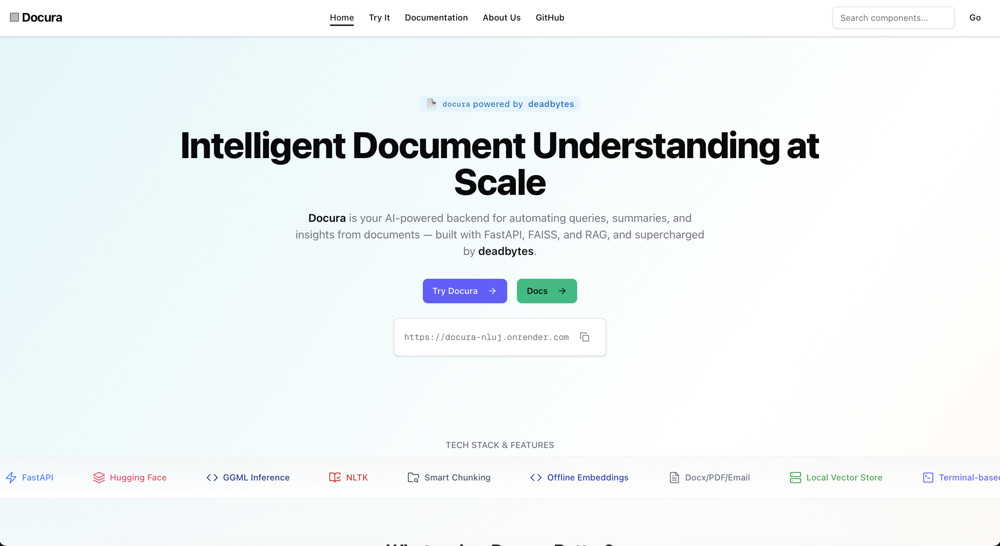
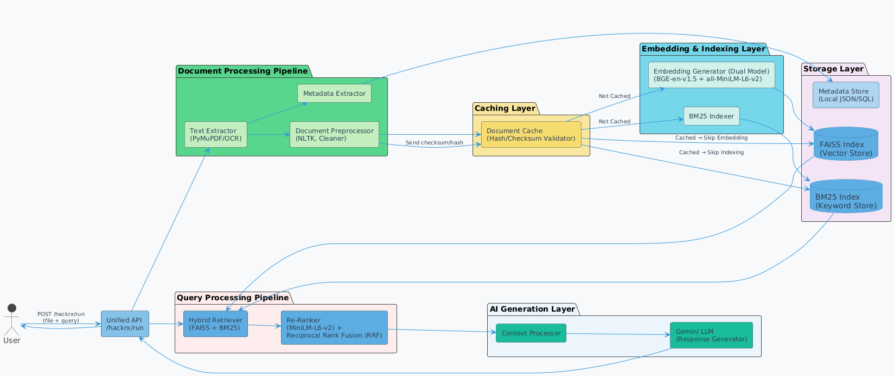

# 🔍 Docura - RAG-based Agentic FAISS Pipeline

Docura is an advanced **Retrieval-Augmented Generation (RAG)** pipeline with **agentic reasoning capabilities** for high-accuracy document search and contextual response generation.

**Note:** This repository contains only the **backend code** for Docura.  
The frontend source code can be found here: [Docura-AI Frontend Repository](https://github.com/msnabiel/Docura-AI)


**Note:** This repository is dockerized you can pull at docker pull msnabiel/docura
docker run -d -p 8000:8000 msnabiel/docura


## 📌 **Live Demo & Documentation**
🚀 **Live Website:** **https://docura-ai.vercel.app**  
_This site includes interactive UI, API documentation, and step-by-step guides._



## 🚀 Key Features

- **Multi-Embedding Hybrid Retrieval** (BGE EN v1.5 + all-MiniLM-L6-v2)
- **RFF Fusion Framework** for optimized retrieval blending
- **FAISS Vector Store** with scalable indexing
- **Agentic Reasoning** with structured JSON outputs
- **Multi-format Document Support** (PDF, DOCX, PPTX, etc.)

## 🏗 System Architecture and Flow



## 📈 Application Interface


## Project Structure
```
├── main.py                 # FastAPI app entry point
├── cache.py                 # Cache handling logic
├── models.py                # Model definitions / configurations
├── text_extractor.py        # Text extraction pipeline
├── utils.py                 # Utility functions
├── requirements.txt         # Project dependencies
├── Dockerfile               # Docker image definition
├── README.md                # Project documentation
├── images/                  # Image assets
└── prompts/                 # Prompt templates
```

## 📊 Retrieval Components

| Component | Model | Purpose | Weight |
|-----------|-------|---------|--------|
| Dense Embeddings | BGE EN v1.5 | Semantic similarity | 0.65 |
| Light Embeddings | all-MiniLM-L6-v2 | Fast retrieval | 0.20 |
| Keyword Search | BM25 | Exact matching | 0.15 |

## 🚀 How to Run

### Step 1: Environment Setup
```bash
# Clone repository
git clone https://github.com/msnabiel/Docura.git
cd Docura

# Create virtual environment
python -m venv venv
source venv/bin/activate  # Linux/Mac
# or
venv\Scripts\activate     # Windows

# Install dependencies
pip install -r requirements.txt
```

### Step 2: Configure Environment
Create `.env` file:
```env
GEMINI_API_KEY_PAID=your_gemini_key
```
### Step 3: Start the Application
```bash
# Start API server
python main.py
# or
uvicorn app:app --reload --port 8000
```

### Step 4: Access the Interface
Open API at below URL for detailed information: 
```bash 
http://localhost:8000
```

## Docker Build
docker build -t docura .
docker run -d -p 8000:8000 docura

## 📈 Performance Metrics & USP

| Category                | Our Architecture                                                                                                                                                                              | Typical Pipeline                                                                                                   | Performance (Quantified)                                                                                                                                                 |
|-------------------------|-----------------------------------------------------------------------------------------------------------------------------------------------------------------------------------------------|----------------------------------------------------------------------------------------------------------------------|--------------------------------------------------------------------------------------------------------------------------------------------------------------------------|
| **Embedding + Preprocessing** | - **Dual Embedding Models:** `BAAI/bge-small-en-v1.5` + `sentence-transformers/all-MiniLM-L6-v2`<br>- Preprocessed using **NLTK**: tokenization, stopword removal, lemmatization | - Single model (e.g., `all-MiniLM` or `bge-small`)<br>- Basic preprocessing only                                    | 🔹 ~15–20% higher MRR/NDCG (semantic coverage)<br>🔹 Cleaner inputs = ~10–15% improved embedding consistency                                                               |
| **Semantic & Lexical Search** | - **FAISS (HNSW Index):** dense vector retrieval, top-*k*=50<br>- **BM25 (Rank-BM25)** + custom keyword matcher                                                                          | - FAISS or BM25, not both<br>- No keyword boosting                                                                  | 🔹 ~25–30% recall@50 improvement<br>🔹 Handles edge cases where dense or lexical alone fails                                                                               |
| **Dual Reranking Layer**      | - **Stage 1:** CrossEncoder (`ms-marco-MiniLM-L-6-v2`) on top-*k*=20<br>- **Stage 2:** RRF (Reciprocal Rank Fusion, formula: 1/(k + rank))                                               | - No reranking or simple score-based ordering                                                                       | 🔹 +25–35% increase in top-5 relevance precision<br>🔹 Lower false positives in ranked output                                                                              |
| **System Optimization**       | - **ThreadPoolExecutor** + parallel async processing<br>- Parallel batching for embeddings, FAISS, and CrossEncoder stages                                                             | - Linear or sequential execution                                                                                    | 🔹 30–40% latency reduction<br>🔹 ~1.5–2× higher QPS under concurrent load                                                                                                 |
| **End-to-End Latency**        | - Query time: **10–20 seconds** (on Intel i7, 16GB RAM, batch=10) with reranking enabled                                                                                                 | - Query time: **20–40 seconds** or lower accuracy if faster                                                         | 🔹 Up to 2× faster with reranking<br>🔹 Optimized without GPU dependency (CPU-only viable)                                                                                 |
| **Compute Efficiency**        | - CrossEncoder rerank is batched & limited to *k*=20<br>- RRF is O(n), negligible load<br>- Memory usage: ~600MB RAM (10k docs)                                                          | - No optimization → CrossEncoder (if used) runs on full *k*                                                         | 🔹 ~40–50% lower CPU use/query<br>🔹 Stable at scale                                                                                                                       |
| **Accuracy Efficiency**       | - ~**85–90% top-*k* relevance accuracy** (real-world QA queries)<br>- Only ~50–60% of compute cost vs naive reranking pipelines                                                         | - ~70–75% accuracy or must pay 100% compute for higher accuracy                                                     | 🔹 +20% better accuracy-to-compute ratio<br>🔹 Optimized trade-off without sacrificing quality                                                                             |


## 📋 Supported Formats

- **Text**: PDF, DOCX, TXT, MD
- **Presentations**: PPTX, PPT
- **Spreadsheets**: XLSX, CSV
- **Web**: HTML, XML

## 🤝 Contributing

1. Fork the repository
2. Create feature branch: `git checkout -b feature-name`
3. Commit changes: `git commit -m 'Add feature'`
4. Push to branch: `git push origin feature-name`
5. Submit pull request

## 📞 Support
- **Email**: msyednabiel@gmail.com