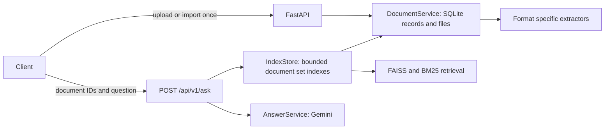

# Docura

Docura stores documents, builds reusable retrieval indexes, and answers questions with Gemini. The repository contains a FastAPI backend and a standalone `DocuraAI.tsx` chat component.

## Architecture


```mermaid
flowchart LR
  Client -->|upload or import once| API[FastAPI]
  API --> Documents[DocumentService: SQLite records and files]
  Documents --> Extractor[Format specific extractors]
  Client -->|document IDs and question| Ask[POST /api/v1/ask]
  Ask --> IndexStore[IndexStore: bounded document set indexes]
  IndexStore --> Documents
  IndexStore --> Retrieval[FAISS and BM25 retrieval]
  Ask --> Answer[AnswerService: Gemini]
```

`/api/v1/ask` is the only route that calls Gemini. Upload and import return an opaque `upload:<id>`; parse and search routes use those IDs but do not call the answer model. `DocumentService` owns upload files, owner bound records, expiry, deletion, and extracted text caching. `IndexStore` builds an immutable index for each owner and document set, reuses it across questions, and evicts old indexes by size and TTL. PDF, DOCX, PPTX, and other format specific extraction remains in `text_extractor.py`.

Indexes are in memory and rebuilt after a server restart. Documents and extracted text are stored in `DOCURA_DATA_DIR` (default `./data`). Keep this directory on a persistent volume in deployments. Expired documents are removed at startup and periodically; `DELETE /api/v1/documents/{id}` removes a document sooner and invalidates indexes containing it.

## Run

```bash
python -m venv .venv
source .venv/bin/activate
pip install -r requirements.txt
cp .env.example .env
# Set GEMINI_API_KEY_PAID and DOCURA_API_TOKEN in .env.
uvicorn main:app --port 8000
```

The first start may download the BGE and MiniLM embedding models. API documentation is at `http://localhost:8000/docs`.

Docker:

```bash
docker build -t docura .
docker run -p 8000:8000 --env-file .env -v docura-data:/app/data docura
```

Set `DOCURA_API_TOKENS_JSON` to a JSON object of owner names and distinct bearer tokens for separate users. `DOCURA_API_TOKEN` remains a single owner option. Every `/api/v1` route requires a bearer token. Set `DOCURA_ALLOWED_ORIGINS` for browser clients on another origin and `DOCURA_ALLOWED_URL_HOSTS` for remote imports or model requested API calls. Only explicitly listed hostnames are allowed.

## API workflow

Upload once, save the returned `id`, and include it in each question. Send up to 12 previous `{role, content}` turns in `history` for follow-up questions.

```bash
curl -H "Authorization: Bearer YOUR_TOKEN" -F "file=@document.pdf" \
  http://localhost:8000/api/v1/upload

curl -H "Authorization: Bearer YOUR_TOKEN" -H "Content-Type: application/json" \
  -d '{"documents":["upload:REPLACE_WITH_RETURNED_ID"],"question":"Summarize this document","search_strategy":"ensemble"}' \
  http://localhost:8000/api/v1/ask

curl -X DELETE -H "Authorization: Bearer YOUR_TOKEN" \
  http://localhost:8000/api/v1/documents/REPLACE_WITH_RETURNED_ID_WITHOUT_PREFIX
```

| Route | Purpose |
| --- | --- |
| `POST /api/v1/upload` | Store a file and return its document ID |
| `POST /api/v1/documents/import` | Import an allowed remote URL and return its document ID |
| `DELETE /api/v1/documents/{id}` | Delete one owned document |
| `POST /api/v1/ask` | Retrieve context and generate an answer |
| `POST /api/v1/parse`, `/parse/batch` | Inspect extracted text |
| `POST /api/v1/search`, `/search/multi` | Search without a model call |
| `GET /api/v1/search/stats`, `/cache/stats` | Inspect index and extraction counts |
| `POST /api/v1/cache/clear` | Clear this owner's cached indexes and extracted text |

Files and remote responses are limited to 10 MiB. ZIP archives are limited to 100 members and 30 MiB uncompressed. Remote imports reject redirects and private network addresses. The standalone chat component uses the same origin by default; set `NEXT_PUBLIC_DOCURA_API_URL` when hosting it separately.

## Source layout

| File | Responsibility |
| --- | --- |
| `main.py`, `models.py` | HTTP routes, authentication, and request schemas |
| `document_service.py`, `extraction_models.py` | Persistent document lifecycle and extraction cache |
| `text_extractor.py` | Format specific extraction |
| `retrieval.py`, `index_store.py` | Search and reusable indexes |
| `answer_service.py`, `config.py`, `prompts/` | Gemini requests and answer prompts |
| `source_security.py` | Remote URL validation and source limits |

The earlier code review and its findings are in [CODE_REVIEW.md](CODE_REVIEW.md).
